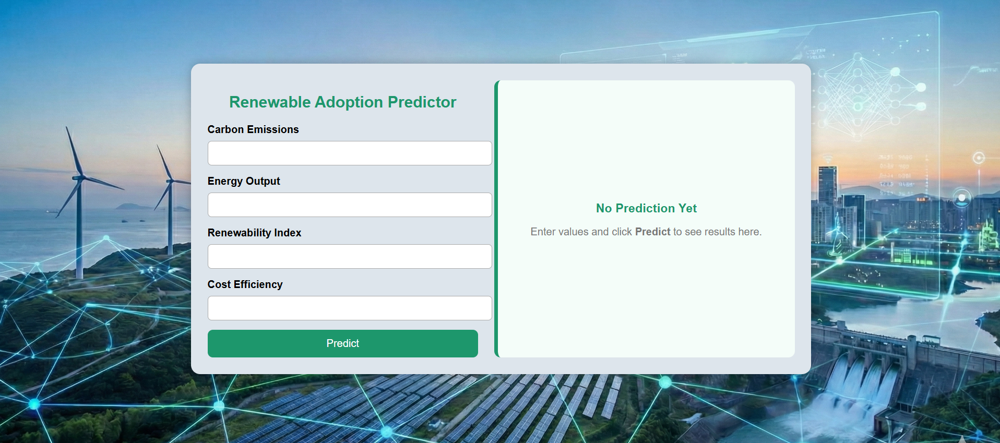

<h1 align="center">🌱 Renewable Adoption Predictor</h1>

<p align="center">
  <em>A Machine Learning–powered web API to predict renewable energy adoption</em>
</p>

<p align="center">
  <a href="https://renewable-adoption-predictor.onrender.com"><strong>🌐 Live API</strong></a>
  •
  <a href="https://github.com/kri6228/Renewable_Adoption_Predictor"><strong>📦 Source Code</strong></a>
</p>

<p align="center">
  
  
  
  
</p>

<hr/>

<h2>📸 Preview</h2>

<p align="center">
  <!-- Optional: Add API or Postman screenshot -->
  
</p>

<hr/>

<h2>🌟 Overview</h2>

<p>
Renewable Adoption Predictor is a Machine Learning–based backend application that predicts the adoption of renewable energy
based on input parameters. The trained ML model is exposed through a <strong>Flask REST API</strong> for real-world usage.
</p>

<p>
This project demonstrates:
<ul>
  <li>✔ End-to-end Machine Learning deployment</li>
  <li>✔ Serving ML predictions via Flask API</li>
  <li>✔ Handling real deployment challenges (dependency size, hosting limits)</li>
  <li>✔ Industry-style backend architecture for ML systems</li>
</ul>
</p>

<hr/>

<h2>🚀 Features</h2>

<table>
  <tr>
    <td>🤖 Machine Learning–based Predictions</td>
    <td>⚡ Fast API Response using Gunicorn</td>
  </tr>
  <tr>
    <td>🌐 REST API for Easy Integration</td>
    <td>📊 Trained using Real Data (Scikit-Learn)</td>
  </tr>
  <tr>
    <td>☁️ Cloud Deployment on Render</td>
    <td>🧠 Clean & Modular Codebase</td>
  </tr>
</table>

<hr/>

<h2>🛠️ Tech Stack</h2>

<ul>
  <li><strong>Python</strong> – Core programming language</li>
  <li><strong>Flask</strong> – Backend web framework</li>
  <li><strong>Scikit-learn</strong> – Machine Learning model</li>
  <li><strong>NumPy & Pandas</strong> – Data processing</li>
  <li><strong>Gunicorn</strong> – Production WSGI server</li>
  <li><strong>Render</strong> – Cloud deployment</li>
</ul>

<hr/>

<h2>📂 Project Structure</h2>

```plaintext
📦 Renewable_Adoption_Predictor
│
├── app.py                 # Flask application
├── requirements.txt       # Python dependencies
├── model.pkl              # Trained ML model
├── README.md              # Documentation
└── other supporting files
```
<hr/> <h2>⚙️ How to Run Locally</h2> <ol> <li>Clone the repository</li> </ol>
git clone https://github.com/kri6228/Renewable_Adoption_Predictor.git
cd Renewable_Adoption_Predictor
<ol start="2"> <li>Install dependencies</li> </ol>
pip install -r requirements.txt
<ol start="3"> <li>Run the Flask app</li> </ol>
python app.py
<hr/> <h2>🔌 API Usage</h2> <p><strong>Endpoint:</strong></p>
POST /predict
<p><strong>Live API:</strong></p> <p> 👉 <a href="https://renewable-adoption-predictor.onrender.com"> <strong>https://renewable-adoption-predictor.onrender.com/</strong> </a> </p> <p><strong>Sample Request:</strong></p>
{
  "feature1": 5,
  "feature2": 3,
  "feature3": 1
}
<p><strong>Sample Response:</strong></p>
{
  "prediction": 1
}
<hr/> <h2>🌍 Deployment Notes</h2> <p> The backend is deployed on <strong>Render</strong> using <strong>Gunicorn</strong>. Due to free-tier limitations, the service may experience a short delay on the first request after inactivity. </p> <hr/> <h2>🤝 Contributing</h2> <p> Contributions are welcome! Feel free to fork the repository, raise issues, or submit pull requests. </p> <hr/> <h2>📜 License</h2> <p> This project is open-source and available under the MIT License. </p> <hr/> <h2 align="center">⭐ If you like this project, don't forget to star the repo!</h2>
